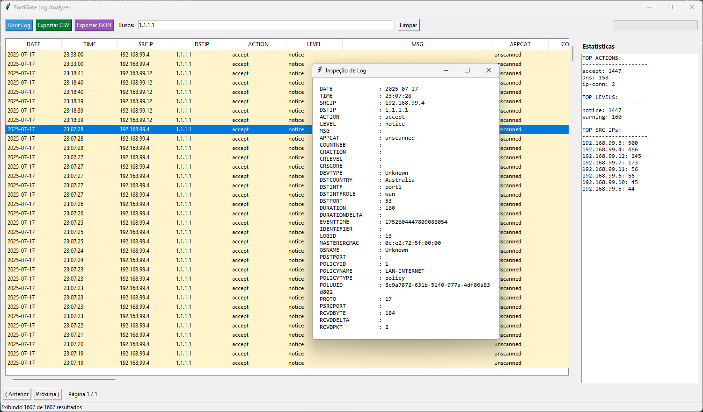

# FortiNet Log Analyzer

  [](https://opensource.org/licenses/MIT)

A lightweight desktop application developed in Python for viewing, analyzing, and processing Fortinet equipment logs.
It provides a user-friendly interface for security professionals to manage UTM logs without requiring a FortiAnalyzer appliance.

## Key Features

- **Graphical Log Viewer:** Load and display `.log` or `.txt` files in `key=value` format.
- **Dynamic Search:** Case-insensitive filtering across all log fields.
- **Visual Analysis:** Automatic color-coding for critical levels (alert, critical, error) and block actions (deny, block).
- **Live Statistics:** Side panel showing real-time stats (Top Source IPs, Top Actions, and Severity Levels).
- **High Performance:** Dynamic paging system (3,000 records per page) for smooth handling of large files.
- **Data Export:** Export filtered results to `.csv` or `.json` formats.
- **Detailed Inspection:** Double-click any entry to view all log metadata in a dedicated window.

## Screenshots



## Quick Start

### Prerequisites
* Python 3.x

### Installation & Execution

1. **Clone the Repository**
   
   ```bash
   git clone https://github.com/solopx/fortinet-log-analyzer.git
   cd fortinet-log-analyzer
   ```
   
3. **Install Dependencies**
   
   ```bash
   pip install -r requirements.txt
   ```
   
5. **Run the App**
   
   ```bash
   python src/main.py
   ```

## How to Use

1. **Load Logs**: Click the **"Abrir Log"** button and select a log file (`.log` or `.txt`).
2. **Filtering**: Type search terms in the search bar. Click **"Limpar"** to clear filters and show all results.
3. **Sorting**: Click on column headers to sort data in ascending or descending order.
4. **Export as Text**: Right-click on any row to export the selected line as plain text.
5. **Export Data**: Click **"Exportar CSV"** or **"Exportar JSON"** to save your filtered results into those formats.
6. **Detailed View**: Double-click any log entry to open a pop-up window with its full metadata.
7. **Statistics**: Use the right-side panel to visualize the most common traffic patterns (Top IPs, Actions, etc.).

## Expected Log Format
The analyzer parses standard key=value log entries, such as:

`date=2023-10-27 time=10:30:00 logid=0000000000 type=traffic subtype=forward srcip=192.168.1.10 srcport=54321 srcintf="port1" dstip=8.8.8.8 dstport=53 dstintf="wan1" policyid=1 action=accept service="dns" utmaction=passthrough sentbyte=123 rcvdbyte=456`

## License
Distributed under the MIT License. See LICENSE for more information.

---

Developed by solopx GitHub: https://github.com/solopx/
